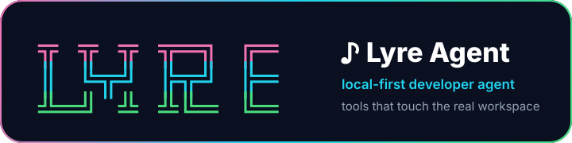

<p align="center">
  
</p>

<!-- Plain-text fallback:
╦  ╦ ╦ ╦═╗ ╔═
║  ╚╦╝ ╠╦╝ ╠═
╩═╝ ╩  ╩╚═ ╚═
-->

# lyre-agent

Local-first CLI agent for developer workflows.

`lyre-agent` is designed as a lightweight, local-first CLI agent for engineering work. It borrows the proven architectural ideas from Hermes Agent — tool-first execution, provider-agnostic LLMs, sessions, memory, skills, and platform gateways — but keeps the core intentionally small.

## MVP commands

```bash
python -m lyre_agent.cli version
python -m lyre_agent.cli config-show
python -m lyre_agent.cli tool-list
python -m lyre_agent.cli run "查看当前目录文件" --cwd .
python -m lyre_agent.cli chat
```

## Startup TUI

Interactive mode uses a compact Rich-powered startup TUI:

```bash
python -m lyre_agent.cli
python -m lyre_agent.cli chat
```

It renders a modern branded status card with:

- colorful compact LYRE logo
- current profile
- workspace
- model provider/name
- vivid enabled tool chips
- session status
- safety mode
- missing optional configuration warnings

Use quiet mode for scripts or plain output:

```bash
python -m lyre_agent.cli --no-banner
python -m lyre_agent.cli chat --quiet
LYRE_NO_BANNER=1 python -m lyre_agent.cli chat
```

Interactive slash commands:

```text
/help      show commands
/status    show runtime status
/tools     list tools
/config    print resolved config
/clear     clear terminal
/exit      quit
```

## Design goals

- Local-first: operate on the current workspace.
- Tool-based: shell, file, git first; integrations later.
- Safe by default: risky shell commands are classified before execution.
- Small MVP: no required third-party dependencies yet.
- Provider-agnostic: OpenAI-compatible providers first, local models later.
- Skill-driven: reusable workflows should be stored as markdown skills.

## Design Inspiration: Hermes + OpenClaw

Lyre Agent borrows from both Hermes Agent and OpenClaw, but keeps a narrower scope.

**Positioning:**

```text
Lyre Agent = Hermes-style Runtime + OpenClaw-style Control Plane
```

From Hermes, Lyre Agent borrows:

- tool-first agent loop
- provider-agnostic LLM layer
- skills as reusable workflows
- persistent memory and session continuity
- self-improving workflows through skill sedimentation

From OpenClaw, Lyre Agent borrows:

- gateway/channel abstraction
- control-plane thinking
- user/chat/task routing
- permission model
- approval flow and audit boundaries
- stronger safety design around tools and execution

Long-term layering:

```text
┌────────────────────────────────────────────┐
│ OpenClaw-inspired Control Plane             │
│ users · chats · channels · permissions      │
│ routes · approvals · audit logs             │
└──────────────────────┬─────────────────────┘
                       │
┌──────────────────────▼─────────────────────┐
│ Lyre Agent Runtime                          │
│ prompt builder · sessions · tool loop       │
│ model provider · context management         │
└──────────────────────┬─────────────────────┘
                       │
┌──────────────────────▼─────────────────────┐
│ Hermes-inspired Capability Layer            │
│ tools · skills · memory · workflows         │
└────────────────────────────────────────────┘
```

Lyre Agent should not become a full clone of either system. The core should stay small and local-first, while platform gateways, control-plane policies and integrations remain optional layers.

## Architecture

Lyre Agent follows a small-core, tool-first architecture.

The core runtime is responsible for:

1. Building the conversation context from config, session, memory and skills.
2. Calling an LLM provider with OpenAI-compatible tool schemas.
3. Dispatching tool calls through a central registry.
4. Appending normalized tool results back into the conversation.
5. Repeating until the model returns a final answer.

High-level flow:

```text
CLI / Chat / API / Webhook
          |
          v
   Agent Runtime
          |
          v
    LLM Provider
          |
          v
    Tool Registry
          |
          v
 File / Shell / Git / HTTP / Platform Tools
```

Long-lived context is provided by sessions, memory and skills:

```text
Config + Session + Memory + Skills
              |
              v
        Prompt Builder
              |
              v
        Agent Runtime
```

## Module layout

Planned module boundaries:

```text
lyre_agent/
  cli.py              # terminal entrypoints
  runtime.py          # agent loop and orchestration
  prompt.py           # system prompt and context builder
  config.py           # non-secret configuration
  paths.py            # LYRE_HOME/profile-safe paths

  llm/
    base.py           # provider interface
    openai_compatible.py
    echo.py

  tools/
    base.py           # Tool and ToolResult contracts
    registry.py       # central tool registry
    toolsets.py       # toolset grouping and enablement
    shell.py
    file.py
    git.py
    http.py
    github.py
    feishu.py

  session/
    store.py          # SQLite-backed sessions/messages/tool calls
    models.py

  memory/
    store.py          # durable user/project memory
    search.py

  skills/
    loader.py         # SKILL.md loader
    matcher.py        # task-to-skill matching
    models.py

  gateway/
    server.py         # optional HTTP/API mode
    models.py
    platforms/
      feishu.py
      telegram.py

  security/
    risk.py           # command/file operation risk classification
    approvals.py      # confirmation flow
    sandbox.py        # workspace boundary checks
```

The current MVP already includes the first slice of this layout: CLI, runtime, config, an offline echo provider, security classification, and file/shell/git tools.

## Core design principles

### 1. Local-first

The default operating model is the current workspace. Lyre Agent should avoid heavy local state, large dependencies and unnecessary generated files.

### 2. Tool-first

The model should not pretend to operate on the system. All real actions should go through explicit tools with normalized results and audit-friendly metadata.

### 3. Provider-agnostic

The runtime should not depend on a specific model SDK. Providers should implement a common interface. OpenAI-compatible tool calling is the first target because it covers OpenAI, OpenRouter, vLLM, LM Studio and many local gateways.

### 4. Small core, pluggable edges

The core should stay small. Integrations such as Feishu, Telegram, GitHub automation, browser automation and MCP should be optional toolsets or adapters, not mandatory dependencies.

### 5. Secret-safe

Normal settings belong in config files. Secrets belong in environment variables, `.env`, or auth stores. Tokens must not be written to memory, skills, logs or committed files.

### 6. Skill-driven

Repeatable workflows should become skills. A skill is a markdown document with trigger conditions, prerequisites, steps, verification and common pitfalls.

### 7. Profile-safe

All persistent paths should go through a central path helper, similar to Hermes' home/profile model. This allows isolated profiles for different projects, teams or platforms.

## Runtime loop

Target runtime behavior:

```text
user prompt
  -> load config/session/memory/skills
  -> build messages
  -> call LLM with tool schemas
  -> if tool calls: dispatch tools and append results
  -> repeat until final answer
```

Pseudo-code:

```python
def run(prompt, session_id=None):
    session = session_store.load_or_create(session_id)
    memories = memory.search(prompt)
    skills = skill_matcher.match(prompt)
    tools = registry.enabled_tools()

    messages = prompt_builder.build(
        session=session,
        memories=memories,
        skills=skills,
        user_prompt=prompt,
    )

    for _ in range(config.agent.max_turns):
        response = llm.complete(messages, tools=tools.schemas())

        if response.tool_calls:
            for call in response.tool_calls:
                result = tool_dispatcher.dispatch(call)
                messages.append(tool_result_message(result))
            continue

        return response.content

    return "Task did not finish: max turns reached."
```

## Tool system

Tools are registered centrally. Each tool should expose:

- `name`
- `toolset`
- `description`
- `input_schema`
- `handler`
- optional `check_fn`
- optional `requires_env`

This allows the runtime to export model-compatible schemas, disable unavailable tools, and group capabilities by environment.

Suggested toolsets:

```text
core       clarify, think
file       read_file, write_file, patch_file, search_files
terminal   shell, background_process
git        git_status, git_diff, git_log
http       http_get, http_post
memory     memory_add, memory_search
skills     skill_list, skill_view, skill_create
github     GitHub API helpers
feishu     Feishu send/reply/mention helpers
```

## Sessions, memory and skills

### Sessions

Sessions persist conversation history and tool calls:

```sql
sessions(id, title, cwd, created_at, updated_at)
messages(id, session_id, role, content, created_at)
tool_calls(id, session_id, name, args, result, created_at)
```

### Memory

Memory should be durable but compact:

- user preferences
- project conventions
- environment quirks
- recurring tool lessons

### Skills

Skills live under:

```text
~/.lyre-agent/skills/<skill-name>/SKILL.md
```

Recommended structure:

```md
---
name: example-skill
description: What this workflow does
---

# Trigger conditions
# Prerequisites
# Steps
# Verification
# Common pitfalls
```

## Gateway direction

Lyre Agent should eventually support:

```bash
lyre-agent serve
```

With endpoints such as:

```http
POST /v1/run
POST /v1/chat
POST /webhook/feishu
POST /webhook/telegram
```

All platforms should normalize into one message model:

```python
class IncomingMessage:
    platform: str
    chat_id: str
    user_id: str
    text: str
    raw: dict
```

Then all platforms share the same `AgentRuntime`.

## Roadmap

### Phase 1: Hermes-style Runtime

1. Add `paths.py` and profile-safe storage.
2. Refactor tool registry toward Hermes-style registration metadata.
3. Add `toolsets.py` and config-based enable/disable.
4. Implement OpenAI-compatible LLM provider.
5. Replace shortcut runtime with a real tool-calling loop.
6. Add prompt builder and context management.

### Phase 2: Hermes-style Skills and Memory

1. Add SQLite session store.
2. Add memory store and retrieval.
3. Add skill loader and matcher.
4. Add workflow/skill sedimentation after successful complex tasks.
5. Add session resume and conversation export.

### Phase 3: OpenClaw-style Control Plane

1. Add policy model for users, chats, workspaces and tools.
2. Add approval flow for risky tool calls.
3. Add audit logs for tool execution and file writes.
4. Add gateway-independent `IncomingMessage` and `OutgoingMessage` models.
5. Add routing rules for CLI/API/platform messages.

### Phase 4: Platform Integrations

1. Add API server mode.
2. Add Feishu gateway adapter.
3. Add Telegram gateway adapter.
4. Add GitHub webhook/tooling adapter.
5. Add optional MCP bridge.

## Maintaining this repository

Code changes should follow the repository maintenance workflow:

- [Maintenance workflow](docs/maintenance-workflow.md)
- [Pull request template](.github/pull_request_template.md)
- [Issue templates](.github/ISSUE_TEMPLATE/)

The short version:

- use small branches and PRs for non-trivial changes
- run compile and CLI smoke checks before opening PRs
- keep secrets out of source, logs, docs and memory
- preserve local-first behavior
- prefer squash merge after verification

## Current MVP status

Implemented:

- CLI entrypoint
- config loader
- runtime skeleton
- offline echo provider
- tool registry
- file tools
- shell tool
- git tools
- command risk classification
- smoke tests

Next recommended step:

```text
paths.py + Hermes-style Tool Registry + OpenAI-compatible tool loop
```
